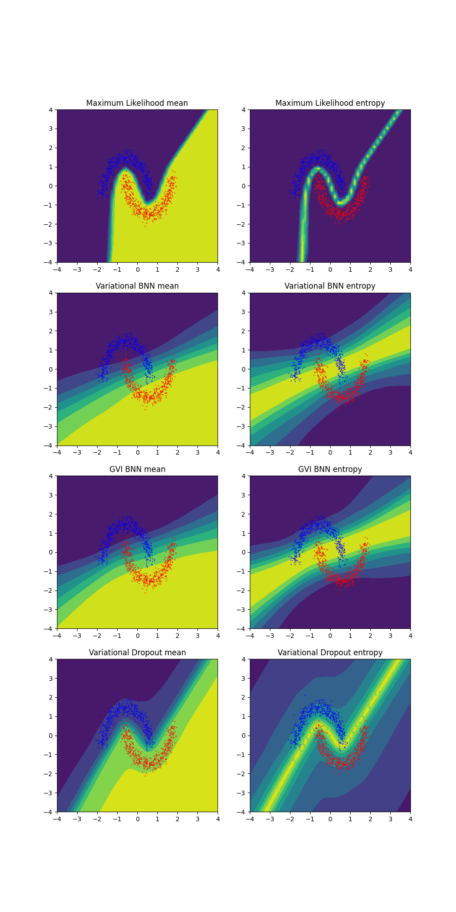

# Torch variational Bayesian deep learning

This library implements many variational Bayesian layers which can be used for variational inference for example. The approximate Bayesian approaches create an approximation for the distribution of neural network parameters, which is in general intractable. The Hamiltonian Monte Carlo is the golden standard for sampling from the posterior, but is typically too expensive to use in practice, unless you have access to large clusters and use for example MNIST sized images. Thus the Bayesian approximations can yield computationally tractable alternatives.

This library utilizes Pytorch as the framework and tries to follow Pytorch conventions for layers as much as possible.

Currently the nn.py file contains so-called VI-Layers, that have been designed to be used in variational inference, however, can be utilized without variational objectives as well. Instead of defining the parameters of the layers as:

    self.weight = torch.nn.Parameter(torch.Tensor(*tensor_shape))

The parameters are defined through their probability distributions, which are defined as torch.nn.Module objects in module_distributions, for example:

    self.weight_distribution = module_distributions.Normal(tensor_shape)

The module_distributions wraps torch.distributions.distribution.Distribution objects such that they can have trainable parameters. For example the module_distributions.Normal defines trainable mean and variance parameters, and when sampling or evaluating probabilities it makes a Distribution object using its parameters.

In the forward call, parameters are sampled and used as the parameters of the layer. For example:

    class MyProbabilisticLinear(nn.Module):
        def __init__(self,n_in,n_out):
            ...
            self.weight_distribution = module_distributions.Normal((n_out,n_in))
            ...
        def forward(self,input):
            weights = self.weight_distribution.sample()
            output = torch.nn.functional.linear(input,weights)
            return output

In the nn.py, there are ready made layers in the pytorch style. The VI layers utilize a parent class "VariationalLayer" that stores approximate posterior distributions and prior distributions within torch.nn.ModuleDict dictonaries. These layers have the same arguments as normal pytorch layers with the addition of arguments that control the distributions types and possible gradient variance reduction methods, like the local reparametrization trick. Example:

    class MyBayesianNetwork(nn.Module):
        def __init__(self):
            super().__init__()
            self.linear1 = VILinear(in_features = 1,
                                    out_features = 10,
                                    weight_posterior = md.Normal,
                                    weight_prior = md.StandardNormalPrior,
                                    bias_posterior = md.Normal,
                                    bias_prior = md.StandardNormalPrior,
                                    gradient_variance_reduction_method = None)
            self.activation = nn.ReLU()
            self.linear2 = VILinear(in_features = 10,
                                    out_features = 1,
                                    weight_posterior = md.Normal,
                                    weight_prior = md.StandardNormalPrior,
                                    bias_posterior = md.Normal,
                                    bias_prior = md.StandardNormalPrior,
                                    gradient_variance_reduction_method = None)
        def forward(self,x):
            h = self.activation(self.linear1(x))
            return self.linear2(h)

It is also possible to convert existing pytorch network into a bnn by using nn.convert_to_bnn, example:
    mynet = torch.nn.Sequential(torch.nn.Linear(1,10),torch.nn.ReLU(),torch.nn.Linear(10,1))
    bnn = nn.convert_to_bnn(mynet)

Kullback-Leibler divergence can be computed using measures.py ready defined BNN_KLD object. It iterates the network and when it finds approximate posterior and prior defined for some parameter, it uses torch.distributions.kl.kl_divergence(p, q) between the distributions. Example:

    bnn = MyBayesianNetwork()
    kl_fun = measures.BNN_KLD()
    kl_value = kl_fun(bnn)

kl_fun is actually an object with the \_\_call__ method computing the function. You should add a scaling term as a second argument to the kl_fun or multiply outside so that the gradient of negative log-likelihood has the same scale as the full elbo. This is in practice 1/N, where N is the number of training examples.

Finally, when multiple Monte Carlo samples are required, one can either call bnn(x) multiple times samples = [bnn(x) for i in range(mc_samples)], or use an nn.MCSampler(bnn,mc_samples) object to wrap the model. Then the forward call returns a stacked tensor, or a list of samples if nn.MCSampler(mc_samples,stack_result=False).

To put it all together here is an example:

    my_network = torch.nn.Sequential(torch.nn.Conv2d(3,32,3,padding=1),
                                     torch.nn.ReLU(),
                                     torch.nn.AdaptiveAvgPool(1),
                                     torch.nn.Flatten(),
                                     torch.nn.Linear(32,1))
    bnn = nn.convert_to_bnn(my_network,
                            gradient_variance_reduction_method_linear="lrt",
                            gradient_variance_reduction_method_convolution="flipout")
    bnn = nn.MCSampler(bnn,mc_samples=10,stack_result=False)
    optimizer = torch.optim.Adam(params = bnn.parameters())
    nll = torch.nn.BCEWithLogitsLoss()
    kl_fun = measures.BNN_KLD()
    kl_scale = 1.0/(batch_size * len(data_loader))
    for x,y in data_loader:
        output = bnn(x)
        nll_values = [nll(sample,y) for sample in output]
        nll_value = torch.mean(torch.stack(nll_values))
        kl_value = kl_fun(bnn,kl_scale)
        ELBO = nll_value + kl_value
        ELBO.backward()
        optimizer.step()
        optimizer.zero_grad()

